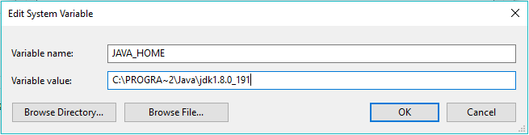
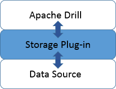
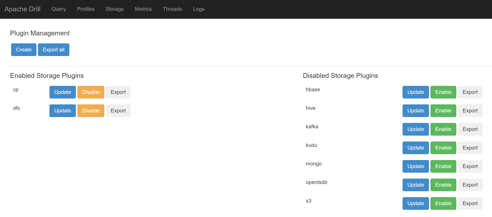
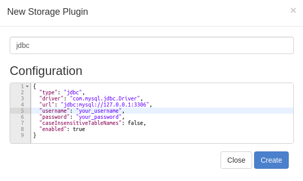
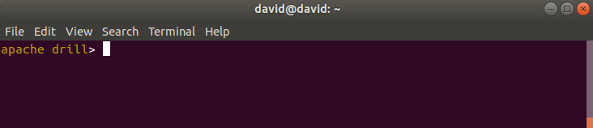
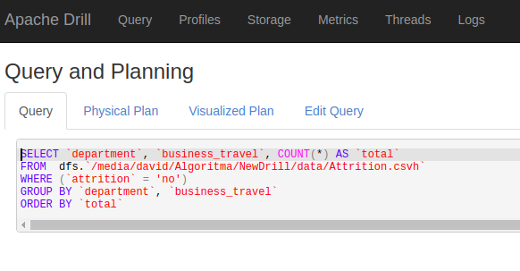

```{r setup, include=FALSE}
knitr::opts_chunk$set(echo = TRUE, message = F)
```


# Introduction
Apache Drill is an open-source software framework that supports data-intensive distributed applications for interactive analysis of large-scale datasets. Drill is the open source version of Google's Dremel system which is available as an infrastructure service called Google BigQuery. One of the reasons for using Apache Drill is that it is easy to use for big data that is on our local computer (not in server). Apache Drill does not do the overall query on the data so it does not use a lot of memory.


# Drill Installation
The drill can be installed in 2 types of modes namely embedded mode and distributed mode. choose the embedded mode to use a single node and distributed to use in a Hadoop environment. In this article, we will discuss the embedded mode version, which means that you only use a single node (your PC).

## Prerequisites
To use Drill on a single node, you need to install Drill in embedded mode. Embedded mode is a quick way to install and try drill without having to perform any configuration tasks. You can install drill in embedded mode on a machine running Linux, Mac OS X, or Windows. Before start install apache drill you need to meet the following prerequisites to run Drill:   

* Install Oracle Java Development Kit (JDK) Version 8
* If you use Windows as an operating system (OS) you need to setup your system variable `JAVA_HOME` by following this step:
  * Right click on this pc
  * Select properties
  * Select Advanced system settings
  * On tab Advanced select Environment variables
  * Select New at system variable
  * Fill the `variabel name` as JAVA_HOME and `variabel value` as your path to JDK like the picture below



## Install Apache Drill 
After installing OpenJDK 8 on your computer and set the `JAVA_HOME` environment variable, now you can install Apache drill on your computer. You can read installation documentation for [windows](https://drill.apache.org/docs/installing-drill-on-windows/), [mac os, and Linux](https://drill.apache.org/docs/installing-drill-on-linux-and-mac-os-x/)    

# Connect to Data Storage
## plugin
A storage plugin is a software module for connecting Drill to data sources. A storage plugin typically optimizes execution of Drill queries, provides the location of the data, and configures the workspace and file formats for reading data. Several storage plugins are installed with Drill that you can configure to suit your environment. Through a storage plugin, Drill connects to a data source, such as a database, a file on a local or distributed file system, or a Hive metastore.

The following image represents the storage plugin layer between Drill and a data source:



here are some plugins that are already available when installing Apache drill:    

* `cp` : Points to JAR files in the Drill classpath, such as employee.json that you can query.    
* `dfs` : Points to the local file system
* `hbase`: Provides a connection to HBase.
* `hive` : Integrates Drill with the Hive metadata abstraction of files, HBase, and libraries to read data and operate on SerDes and UDFs.
* `mongo` : Provides a connection to MongoDB data.
* `kafka` : Provides a connection to Kafka.
* `kudu` : Provides a connection to Kudu.
* `opentsdb` : Provides a connectin to OpenTSDB.

by default plugins that can be used directly are `cp` and `dfs`, to activate other plugins you can open the Apache drill UI in the web browser by opening http://localhost:8047/storage and click Enable button on plugin you choose.



## Registering jdbc Plugin
if you want to connect witth other data storage like mysql you need to create new plugin. if you want to add mysql as plugin, you can following this step

* Install Drill, if you do not already have it installed.
* Copy your database's JDBC driver into the jars/3rdparty directory. (You'll need to do this on every node.)
* Restart Drill. See Starting Drill in Distributed Mode.
* Open drill UI and go to the Storage tab, enter a name in New Storage Plugin. For example, enter jdbc. Each configuration registered with Drill must have a distinct name. Names are case-sensitive.
* In Configuration, set the required properties using JSON formatting as shown in the following example. Change the properties to match your environment.

```{r eval = F}
{
  "type": "jdbc",
  "driver": "com.mysql.jdbc.Driver",
  "url": "jdbc:mysql://localhost:3306",
  "username": "root",
  "password": "mypassword",
  "enabled": true
}  

```




## Start Drill

After complete the drill installation, now you can start the drill in embedded mode using drill drill-embedded command:

* Open command prompt or terminal
* navigate to Drill installation directory
* type `bin/drill-embedded` or if you windows user you can enter to bin file and type `sqlline.bat -u "jdbc:drill:zk=local"`

* if the drill is successfully run, a terminal display will appear as follows


At the root of the Drill installation, a `sample-data` folder includes Parquet files that you can query. The default dfs storage plugin configuration represents the local file system on your machine when you install Drill in embedded mode. you can query the `region.parquet` by type this code in the command Prompt:  

```{r eval= F}
SELECT * FROM dfs.`/usr/local/drill/sample-data/nation.parquet` LIMIT 5;
```

the syntax means select all column in national.parquet and show the five first rows. `dfs.` means points the directory path to the local file system, after `dfs.` is the location of your data.

# Drill in R
To running the Apache drill in R, you must install `sergeant` package. `sergeant` it's tools to transform and query data with apache drill.

```{r eval=FALSE}
install.packages("sergeant")
```
we can run the query in R using function `drill_query()` from `sergeant` package. Before start query we must connect to apache drill using `drill_connection()` and use `drill_active()` to test the connection.
```{r message=FALSE}
library(sergeant)
con <- drill_connection("localhost")
drill_active(con)
```

you can query directly to drill using `drill_query()` function. the parameters used are the connection and query syntax.
```{r message=F}
data <- drill_query(drill_con = con,query = "select * from cp.`employee.json`")
head(data)
```

## query using dplyr
If you are an R user you must be familiar with dplyr. dplyr is a package that is used for data wrangling, with the help of dplyr packages we don't need to do an sql query but enough with dplyr syntax. Before querying with dplyr you must create a new connection using the `src_drill ()` function
```{r}
src_con <- src_drill("localhost")
```
after create connection using src_drill(), now you can connect to data storage using tbl() function from dplyr packages. As an example, we will read the Attrition.csvh data that is on the local computer so that the plugin we use is `dfs`. csvh is an extension that is used for csv format files that have headers.
```{r}
att <- tbl(src_con, "dfs.`/media/david/Algoritma/NewDrill/data/Attrition.csvh`")
glimpse(att)
```

The number of observations on the attrition data is unknown (???), this is because the drill does not query all data in the data storage but only 1000 rows thus speeding up the processing of big data. After successfully connecting with the data storage we can use dplyr Syntax to do the query.
```{r}
att_agg <- att %>% 
  filter(attrition == "no") %>% 
  group_by(department,business_travel) %>% 
  summarise(total = n()) %>% 
  ungroup() %>% 
  arrange(desc(total)) %>% 
  collect()
head(att_agg)
```
When the data transformation has been completed in the Apache Drill we can store data into local tibble (in R) by using `collect()`
function. Queries performed by dplyr are converted to sql syntax using packages sergeant. You can see the query generated on the Apache drill profile profile menu http://localhost:8047/profile




if you want to connect with other data sources such as MySQL you can directly connect using existing plugins
```{r}
loan <- tbl(src_con, "jdbc.`transaction`") # jdbc
head(loan)
```


# conclution
Apache drill is a tool used for processing big data, the main function is to do data exploration. Drills can be connected to various kinds of data storage with the help of plugins. Apache drill can be used to perform SQL queries for data that does not have a schema like JSON. to explore big data apache drill is very helpful because it can save memory by not reading all observations at the beginning.